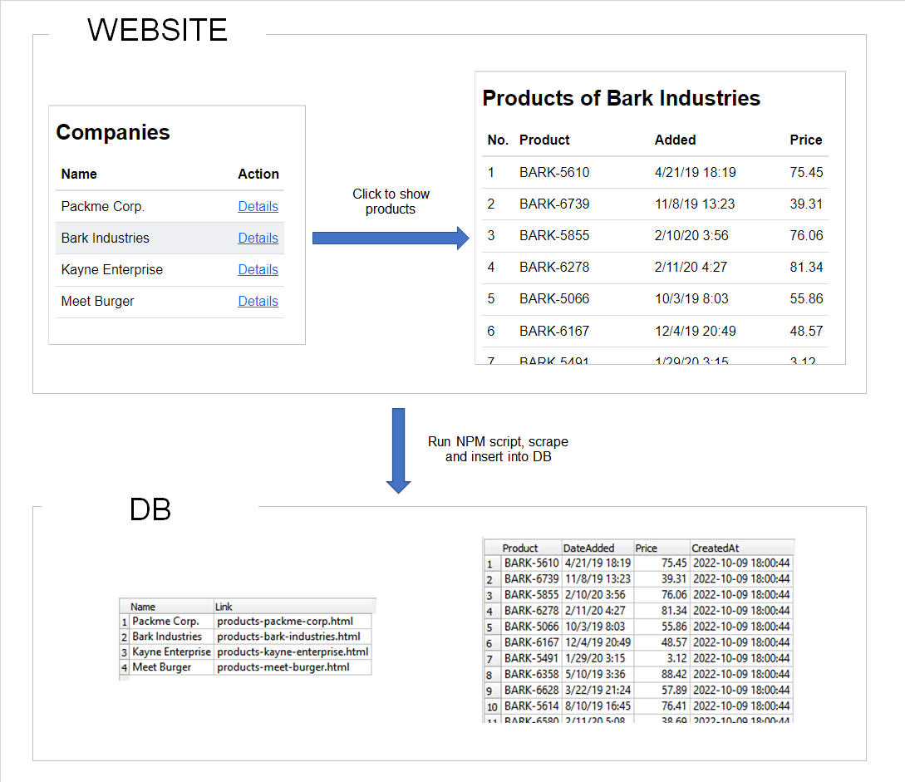

# Node Web Scraper

## Overview

A modular template for web scraping with Node.js.  
It serves as a starting point for any future web scraping project.

## Features

* Modular (separate functionalities: connectors, scrapers, DAOs)
* Stores data in SQLite DB
* Logs
* Supports multiple environments: production, development, test

## General idea

* Each URL has its own [**connector**](./connectors/) responsbile only for getting the HTML
* Each HTML has its own [**scraper**](./scrapers/) responsible only for extracting data
* Each [**DB table**](./db/tables/) has its own class responsible for manipulating data in this table
* [**Scripts**](./scripts/) are the main files, entry points. They are run using **npm scripts**
* Different [**config**](./config/) is loaded based on selected environment. Config determines database file path and logging options.
* Each day has its own [**log file**](./logs/)

## Prerequesities

* [Node.js](https://nodejs.org/en 'Node.js download page') `>=16.13.0`  

## Example usage

```bash
git clone https://github.com/schwastek/node-web-scraper.git

cd node-web-scraper
npm install

# Run in production mode
npm run prod:update-products

# Run in development mode
npm run dev:update-products
```

Logic:

1. Scrape companies from [dummy website](https://schwastek.github.io/node-web-scraper/dummy-website/companies.html) and insert them into DB
2. Get companies from DB
3. Scrape products of each company



# Project architecture

```
📦node-web-scraper  
 ┣ 📂config         # config for each environment
 ┣ 📂connectors     # connector for every URL
 ┣ 📂db             # DB files and handlers for every DB table
 ┣ 📂logs           # 1 log file = 1 day
 ┣ 📂scrapers       # scraper for every URL
 ┣ 📂scripts        # main files
 ┣ 📂test           # test files
```

## Config

```
📂config
 ┣ 📜config.js
 ┣ 📜config.dev.js
 ┣ 📜config.prod.js
 ┗ 📜config.test.js
```
Environment is determined based on `NODE_ENV` variable.  

`NODE_ENV` variable is set by **npm script** in `package.json`.  

NPM scripts use [cross-env](https://www.npmjs.com/package/cross-env "Sets and uses environment variables across platforms")
which takes care of setting variables properly independently from OS (Linux or Windows).

[Debugging in VS Code](https://code.visualstudio.com/docs/editor/debugging#_launchjson-attributes "Debugging in Visual Studio Code - launch.json attributes") starts in **development** mode (set by `env` attribute in `launch.json`). Tests are using **test** environment.

## Connectors

```
📂connectors
 ┣ 📜companies.js
 ┗ 📜products.js
```

Connectors are responsible _only_ for getting response body HTML from specific URL.  
Each URL has its own connector class.

## Database

```
📂db
 ┣ 📂files               # each environment has its own DB file 
 ┃ ┣ 📜dev.db
 ┃ ┣ 📜prod.db
 ┃ ┗ 📜test.db
 ┣ 📂tables              # each table has its own file 
 ┃ ┣ 📜companies.js
 ┃ ┣ 📜products.js
 ┣ 📜database.js         # DB connector
```

Data is saved to a different DB based on currently set environment.  
Each DB table has its own DAO class.  

**Note:** You can use [SQLiteStudio](https://sqlitestudio.pl/ "SQLite database manager") to browse `.db` files.

## Logs

```
📂logs
 ┣ 📂files  
 ┃ ┣ 📂dev
 ┃ ┃ ┣ 📜2020-03-01.log
 ┃ ┃ ┣ 📜2020-03-02.log
 ┃ ┗ 📂prod
 ┃ ┃ ┣ 📜2020-03-11.log
 ┗ 📜logger.js              # logger instance
```

Each day has its own `.log` file e.g. `2020-03-04.log` in JSON format.

All logs output to the console or a file. I don't avoid client-side console logs in production. Ultimately, it's an npm script being executed from the CLI, you want to know what's happening.

**Note:** Logging is disabled in test environment.

## Scrapers

```
📂scrapers
 ┣ 📜companies.js
 ┗ 📜products.js
```

Scrapers are responsible _only_ for extracting data from passed HTML.

## Scripts

```
📂scripts
 ┗ 📜update-products.js
```

Scripts are the top-level callers, **they put all the pieces together**.  
Also, it's the only place where logging and error handling happen.

Scripts are run using npm (`scripts` field in `package.json`).  
You can run them with `npm run <script-name>`.  

## Tests

```
📂test
 ┗ 📜update-products.test.js
```
Use `npm test` CLI command to run the tests.
