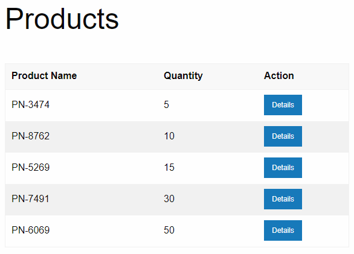
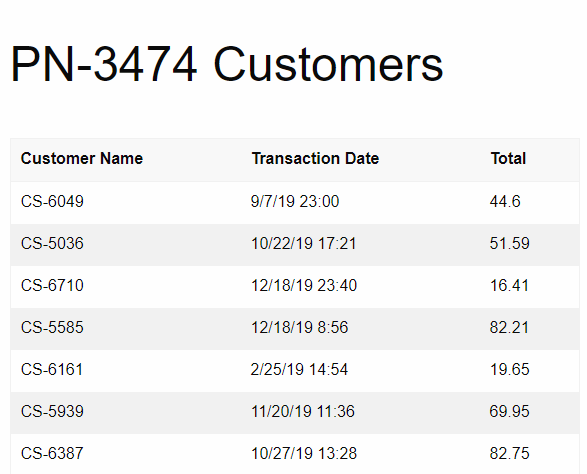
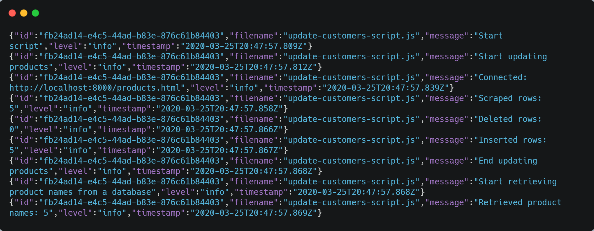
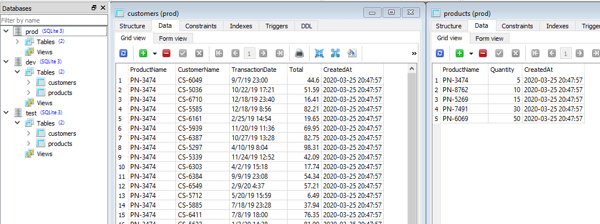

# Overview
A modular template for web scraping with Node.js.

## Features
* Modular (separate functionality: website connectors, data scrapers etc.),
* stores data in an easy to backup SQLite database (one `.db` file), 
* writes logs in JSON to a new `.log` file every day,
* supports multiple environments (production, development, test).

## Motivation
To build a reusable scraping project that serves 
as a starting point for any future web scraping project.

## General idea
* Each website has its own **connector** (`./connectors`) responsbile only for getting the HTML body response.
* Each HTML has its own **scraper** (`./scrapers`) responsible only for extracting data.
* Each **database table** (`./db`) has its own class responsible for manipulating data in this table.
* **Scripts** (`./scripts`) are the main files. They import other modules and put all the pieces together (connectors, scrapers...).
* Scripts are run using **npm scripts** (`npm run <script-name>`).
* **Environment** is set by npm scripts in `package.json`. When debugging in VS Code, environment is set by `env` attribute in `launch.json`.
* Different **config** (`./config`) is loaded based on selected environment. Config determines database file path and logging options.
* Each day has its own **log file** (`./logs`) e.g. `2020-03-04.log` in JSON format.

## Dummy website
I created a simple dummy website to scrape data from. 

```
cd dummy-website-to-scrape
npm install
npm run serve
```

<table style="width:100%; table-layout:fixed;">
  <tr>
    <td></td>
    <td></td>
  </tr>
  <tr>
  <td>
    <a href="http://localhost:8000/products.html" alt="List of products">http://localhost:8000/products.html</a>
    <br/>
    <strong>List of products</strong>
  </td>
  <td>
    <a href="http://localhost:8000/PN-3474-customers.html" alt="Customers of selected product">http://localhost:8000/PN-3474-customers.html</a>
    <br/>
    (or any other <code>/PRODUCT-NAME-customers.html</code>)
    <br/>
    <strong>Customers of selected product</strong>
  </td>
  </tr>
</table>

## Prerequesities
* [Node.js](https://nodejs.org/en 'Node.js download page') `>=12.16.1`  

# Run example

## Install dependencies

```
git clone https://github.com/schwastek/node-web-scraper.git

cd node-web-scraper
npm install

cd dummy-website-to-scrape
npm install
```

## Problem

### Data

We are given two web reports:

Report |  URL 
--- |--- 
Products <small></small> | http://localhost:8000/products.html 
Customers of selected product | http://localhost:8000/PN-3474-customers.html (or any `PN-XXXX-customers.html`)

We'll be using the [dummy website](#dummy-website) running on a local web server to scrape data from.

```
cd dummy-website-to-scrape
npm run serve
```

### Goal

After a year of running scraper daily, we want to have the current data on customers of all products, even these products which appeared only for one day.

**In other words, on the 100th day, we want product customers data for the 100th day even if the product appeared only once, on the 2nd day.**

### Requirements
1. **Scrape** products and their customers,
2. **scrape customers** based on products in DB,
3. keep **historical data** on products,
4. always get **current data** on customers.

To better explain them, let's visualize with data what happens day by day.

#### 1. **Scrape products** from the website
<table class="table">
  <thead>
    <tr>
      <th scope="col">Day</th>
      <th scope="col">Products</th>
      <th scope="col">Customers</th>
      <th scope="col">DB</th>
    </tr>
  </thead>
  <tbody>
    <tr>
      <th scope="row">1</th>
      <td>PN-1, PN-2</td>
      <td>CS-1, CS-2</td>
      <td>PN-1, PN-2, CS-1, CS-2</td>
    </tr>
  </tbody>
</table>

#### 2. **Scrape customers** based on products in DB

> Customers are still being updated even if the product is no longer displayed on the website.

<table class="table">
  <thead>
    <tr>
      <th scope="col">Day</th>
      <th scope="col">Products</th>
      <th scope="col">Customers</th>
      <th scope="col">DB</th>
    </tr>
  </thead>
  <tbody>
    <tr>
      <th scope="row">1</th>
      <td>PN-1</td>
      <td>CS-1, CS-2</td>
      <td>PN-1, CS-1, CS-2</td>
    </tr>
    <tr>
      <th scope="row">2</th>
      <td></td>
      <td></td>
      <td>PN-1, CS-1, CS-2</td>
    </tr>
    <tr>
      <th scope="row">3</th>
      <td>PN-1</td>
      <td>CS-3</td>
      <td>PN-1, CS-3</td>
    </tr>
  </tbody>
</table>

#### 3. Keep **historical data** on products

> DB keeps products data even if it disappeared from the website.

<table class="table">
  <thead>
    <tr>
      <th scope="col">Day</th>
      <th scope="col">Products</th>
      <th scope="col">Customers</th>
      <th scope="col">DB</th>
    </tr>
  </thead>
  <tbody>
    <tr>
      <th scope="row">1</th>
      <td>PN-1</td>
      <td>CS-1</td>
      <td>PN-1, CS-1</td>
    </tr>
    <tr>
      <th scope="row">2</th>
      <td>PN-2</td>
      <td>CS-2</td>
      <td>PN-1, PN-2, CS-1, CS-2</td>
    </tr>
  </tbody>
</table>

#### 4. Always get **current data** on customers

> DB mirrors customers data on the website.

<table class="table">
  <thead>
    <tr>
      <th scope="col">Day</th>
      <th scope="col">Products</th>
      <th scope="col">Customers</th>
      <th scope="col">DB</th>
    </tr>
  </thead>
  <tbody>
    <tr>
      <th scope="row">1</th>
      <td>PN-1</td>
      <td>CS-1, CS-2, CS-3, CS-4</td>
      <td>PN-1, CS-1, CS-2, CS-3, CS-4</td>
    </tr>
    <tr>
      <th scope="row">2</th>
      <td>PN-1</td>
      <td>CS-1</td>
      <td>PN-1, CS-1</td>
    </tr>
  </tbody>
</table>

## Solution

1. Scrape the latest products (`/products.html`) and insert them into DB
2. Get current product names from DB
3. Scrape customers of given products (e.g. `/PN-3474.html`) and insert them into DB

All done by npm script which also sets the environment based on which DB is chosen (`prod.db` on `dev.db`).

```
# Run in production mode
npm run prod:update-customers

# Run in development mode
npm run dev:update-customers
```

For full source code, see [update-customers-script.js](./scripts/update-customers-script.js "Update customers script source code").

## Final result




[SQLiteStudio](https://sqlitestudio.pl/ "SQLite database manager") shown in the screenshot.

# Project architecture
```
📦node-web-scraper  
 ┣ 📂config         # config for each environment
 ┣ 📂connectors     # connector for every page
 ┣ 📂db             # handler for every table and .db files
 ┣ 📂logs           # .json logs (1 log file = 1 day)
 ┣ 📂scrapers       # scraper for every page
 ┣ 📂scripts        # main files being run by npm
 ┣ 📂test           # test files
```

## Config
Environment is determined based on `NODE_ENV` variable.  
```
📂config
 ┣ 📜config.dev.js
 ┣ 📜config.js
 ┣ 📜config.prod.js
 ┗ 📜config.test.js
```
Every file that requires config, gets automatically proper configuration based on currently set environment.  

```js
const config = require('./config/config');

// Output depends on the value of `NODE_ENV` variable
const dbFilepath = config.database.filename;
```

`NODE_ENV` variable is set by **npm script** in `package.json`.  
NPM scripts use [cross-env](https://www.npmjs.com/package/cross-env "Sets and uses environment variables across platforms")
which takes care of setting variables properly independently from OS (Linux or Windows).

```json
"scripts": {
    "prod:update-customers": "cross-env NODE_ENV=production node ./scripts/update-customers-script.js updateCustomers",
    "dev:update-customers": "cross-env NODE_ENV=development node ./scripts/update-customers-script.js updateCustomers",
    "test": "cross-env NODE_ENV=test mocha ./test"
}
```

[Debugging in VS Code](https://code.visualstudio.com/docs/editor/debugging#_launchjson-attributes "Debugging in Visual Studio Code - launch.json attributes") starts in **development** mode (set by `env` attribute in `launch.json`) except for tests which are using **test** environment.


### Production
* use `./config/config.prod.js` as config file
* use `./db/files/prod.db` as DB
* save logs to `./logs/files/prod` folder

### Development
* use `./config/config.dev.js` as config file
* use `./db/files/dev.db` as DB
* save logs to `./logs/files/dev` folder

### Test
* use `./config/config.test.js` as config file
* use `./db/files/test.db` as DB
* silence logs

## Connectors
```
📂connectors
 ┣ 📜customers-connector.js
 ┗ 📜products-connector.js
```
Connectors are responsible _only_ for getting response body HTML from specific (often parameterized) URL. Each URL has its own connector class.

Example of connector definition:

```js
const axios = require('axios');

class CustomersConnector {
  constructor(partNumber) {
    this.url = `http://localhost:8000/${partNumber}-customers.html`;
  }

  async getHtml() {
    const response = await axios.get(this.url);
    return response.data;
  }
}

module.exports = CustomersConnector;
```

## Database
```
📂db
 ┣ 📂files               # each environment has its own file 
 ┃ ┣ 📜dev.db
 ┃ ┣ 📜prod.db
 ┃ ┗ 📜test.db
 ┣ 📜customers-table.js  # DAO for `customers` table
 ┣ 📜database.js         # DB connector
 ┗ 📜products-table.js   # DAO for `customers` table
```
Data is saved to a different database (SQLite `.db` file) based on currently set environment.


Environment | Path
--- | ---
Production | `./db/files/prod.db`
Development | `./db/files/dev.db`
Test | `./db/files/test.db`

**Note:** to browse `.db` files, you can use [SQLiteStudio](https://sqlitestudio.pl/ "SQLite database manager").

Each database table has its own DAO class, for example:

```js
class CustomersTable {
  constructor(db) {
    this.tableName = 'customers';
    this.db = db;
  }

  // (other methods)

  insertRows(rows) {
    let changes = 0;

    const sql = `
    INSERT INTO ${this.tableName}
    (ProductName, CustomerName, TransactionDate, Total)
    VALUES (@ProductName, @CustomerName, @TransactionDate, @Total)
    `;

    const insert = this.db.prepare(sql);

    rows.forEach((row) => {
      const stmt = insert.run(row);
      changes += stmt.changes;
    });

    // Return number of rows affected
    return changes;
  }
}
```

### Dependencies
* [better-sqlite3](https://www.npmjs.com/package/better-sqlite3 "Library for SQLite3 in Node.js") - the fastest and simplest library for SQLite3 in Node.js

## Logs
```
📂logs
 ┣ 📂files  
 ┃ ┣ 📂dev
 ┃ ┃ ┣ 📜2020-03-01.log
 ┃ ┃ ┣ 📜2020-03-02.log
 ┃ ┗ 📂prod
 ┃ ┃ ┣ 📜2020-03-11.log
 ┗ 📜logger.js              # winston logger instance
```
Each day has its own `.log` file e.g. `2020-03-04.log` in JSON format.

All logs output to the console or a file. I don't avoid client-side console logs in production (ultimately, it's an npm script being executed from the CLI, you should know what's going on).

Logs are saved to:
Environment | Path 
--- | --- | ---
Production | `./logs/files/prod/`
Development | `./logs/files/dev/`

**Note:** logging is disabled in test environment.

The following example shows the usage and the log output:

```js
// your-script.js
const logger = require('../logs/logger')(__filename);

logger.info(`Start updating customers of: ${productName}`);
logger.info(`Connected: ${connector.url}`);
logger.info(`Scraped rows: ${rows.length}`);
```
```json
{"id":"a4778c80-6d46-4af2-8528-a82c259b457e","filename":"your-script.js","message":"Start updating customers of: PN-3474","level":"info","timestamp":"2020-03-21T15:42:14.076Z"}

{"id":"a4778c80-6d46-4af2-8528-a82c259b457e","filename":"your-script.js","message":"Connected: http://localhost:8000/PN-3474-customers.html","level":"info","timestamp":"2020-03-21T15:42:14.080Z"}

{"id":"a4778c80-6d46-4af2-8528-a82c259b457e","filename":"your-script.js","message":"Scraped rows: 20","level":"info","timestamp":"2020-03-21T15:42:14.093Z"}
```
Fields `id`, `filename` and `timestamp` are automatically added to the log entries. Although `filename` must be passed when `logger` is required (I use Node.js variable `__filename` get current module's name).

Each script execution has its own UUID generated.   
In other words, when you run a script, a unqiue ID is generated and it stays the same during the script execution (regardless of how many times or where `logger` is required).

### Dependencies: 
* [winston](https://www.npmjs.com/package/winston "Logging library") - popular logging library
* [winston-daily-rotate-file](https://www.npmjs.com/package/winston-daily-rotate-file "A transport for winston") - a transport for winston which logs to a rotating file
* [uuid](https://www.npmjs.com/package/uuid "UUID generator") - UUID generator

## Scrapers
```
📂scrapers
 ┣ 📜customers-scraper.js
 ┗ 📜products-scraper.js
```
Scrapers are responsible _only_ for extracting data from passed HTML.

Example of scraper definition:
```js
const cheerio = require('cheerio');

class CustomersScraper {
  constructor(html) {
    this.html = html;
  }

  extractRows() {
    const $ = cheerio.load(this.html);

    // Get table rows (skip column headers)
    const table = $('table').eq(0);
    const tableRows = table.find('tr').slice(1);

    // Extract rows
    const extractedRows = [];

    tableRows.each((i, tableRow) => {
      const columns = $(tableRow).children('td');

      const row = {
        CustomerName: columns.eq(0).text().trim(),
        TransactionDate: columns.eq(1).text().trim(),
        Total: columns.eq(2).text().trim(),
      };

      extractedRows.push(row);
    });

    return extractedRows;
  }
}

module.exports = CustomersScraper;
```

### Dependencies
* [cheerio](https://cheerio.js.org "Node.js library with jQuery-like syntax") - implementation of core jQuery designed specifically for the server

## Scripts
```
📂scripts
 ┗ 📜update-customers-script.js
```
Scripts are the top-level callers, **they put all the pieces together**.  
Also, it's the only place where logging and error handling happen.

Scripts are run using npm (`scripts` field in `package.json`).  
You can run them with `npm run <script-name>`.  

Example of a script definition (note how it uses all other modules):
```js
const Database = require('./db/database');
const ProductsConnector = require('./connectors/products-connector');
const ProductsScraper = require('./scrapers/products-scraper');
const ProductsTable = require('./db/products-table');
const logger = require('./logs/logger')(__filename);

async function updateProducts() {
  let db = null;
  logger.info('Start updating products');

  try {
    // Get website content
    const connector = new ProductsConnector();
    const html = await connector.getHtml();
    logger.info(`Connected: ${connector.url}`);

    // Scrape website
    const scraper = new ProductsScraper(html);
    const rows = scraper.extractRows();
    logger.info(`Scraped rows: ${rows.length}`);

    // Update DB
    db = Database.open();
    const table = new ProductsTable(db);
    const productNames = rows.map((row) => row.ProductName);
    const { deleted, inserted } = table.updateRowsByProductNames(productNames, rows);
    logger.info(`Deleted rows: ${deleted}`);
    logger.info(`Inserted rows: ${inserted}`);
  } catch (err) {
    logger.error(err.message);
  } finally {
    if (db) db.close();
  }

  logger.info('End updating products');
}

module.exports = updateCustomers;

// Run exported functions from CLI
require('make-runnable');
```


### Dependencies
* [make-runnable](https://www.npmjs.com/package/make-runnable "Runs exported functions from CLI") - runs exported functions from CLI
* other modules of the project

## Tests
```
📂test
 ┣ 📂html-update-customers-script
 ┃ ┣ 📂css
 ┃ ┣ 📂test-1
 ┃ ┣ 📂test-2
 ┃ ┣ 📂test-3
 ┃ ┣ 📂test-4
 ┃ ┗ 📂test-5
 ┗ 📜update-customers-script.test.js
```
Use `npm test` CLI command to run the tests.

### Dependencies
* [mocha](https://mochajs.org/ "JavaScript test framework") - JavaScript test framework
* [chai](https://www.chaijs.com/ "Assertion library") - assertion library
* [nock](https://www.npmjs.com/package/nock "Test modules that perform HTTP requests") - used to test modules that perform HTTP requests (overrides Node's `http.request`)

